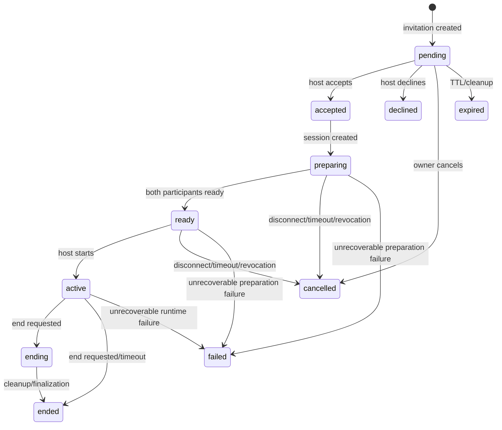

# Our Companion Network

Our Companion Network is a secure NestJS modular monolith for identity, social coordination, Companion publication, Asset Pack distribution, Visits, Portal operations and Developer Debug observability.

REST and PostgreSQL remain authoritative. Socket.IO provides real-time invalidation and notification hints; the Network is not event sourced and is not a microservice architecture.

## Technology stack

- NestJS 10 and TypeScript
- Prisma 5 with PostgreSQL 15
- Passport JWT and bcryptjs
- Socket.IO
- Cloudflare R2 through the AWS S3 SDK
- Redis in the Docker Compose environment and available for future/shared infrastructure when configured; the current application keeps connection ownership and timers in-process
- React 19 Portal with Vite, TanStack Query, React Hook Form, React Router and Zod
- Vitest, Jest and Playwright
- Docker Compose for local PostgreSQL/Redis services

## Quick start

Prerequisites:

- Node.js and npm
- PostgreSQL 15+
- Docker and Docker Compose for the provided local services
- Redis is included in Compose for local infrastructure experiments; core current request handling does not depend on a Redis-backed queue or Socket.IO adapter.

```bash
docker compose up -d
npm install
npx prisma generate
npm run start:dev
```

The API listens on `http://localhost:3001` by default. Copy `.env.example` to `.env` and set explicit production values for database, JWT secrets, Portal origins, storage and administrative credentials. Production requires HTTPS, an exact `PORTAL_ORIGINS` allowlist, `PORTAL_COOKIE_SECURE=true`, strong secrets and deliberately configured Superadmin values.

## Modular monolith architecture

The NestJS application is one deployable process with explicit modules:

- Identity and device sessions.
- Friend requests, friendships and blocks.
- Presence and Socket.IO connection coordination.
- Companion publication and Asset Pack lifecycle.
- Storage adapters for Cloudflare R2.
- Visit invitations and Visit sessions.
- Notifications and Community profiles/discoveries.
- Portal owner APIs and browser authentication.
- Admin and Caretaker Desk APIs.
- Developer Debug ingestion and inspection.
- Meta/compatibility and smoke/test support.

Prisma models in PostgreSQL are the durable state. Domain services publish small invalidation events through per-user Socket.IO rooms (`user:<userId>`), but consumers reload the authoritative REST resource.

## Authentication architecture

### Desktop authentication

Desktop clients use:

- Bearer access tokens on REST requests.
- Rotating refresh tokens.
- A client-supplied device ID bound into the JWT and `DeviceSession`.
- bcrypt-hashed refresh tokens, with the previous refresh-token hash retained during rotation.
- Refresh-token reuse detection that revokes the device session and disconnects the device's Socket.IO connections.
- Device-session revocation on logout and administrative revocation.
- Server-side session, expiry, account-status and device validation for JWT requests.

### Portal authentication

The browser Portal uses a separate cookie transport because browser and Desktop threat models differ:

- Secure HttpOnly access and refresh cookies.
- A device cookie scoped to Portal authentication.
- A non-HttpOnly `oc_csrf` cookie readable by the Portal.
- `X-CSRF-Token` on browser mutations and refresh.
- An exact Origin allowlist from `PORTAL_ORIGINS`/CORS configuration.
- A CSRF hash bound to the `DeviceSession`, with timing-safe comparison.
- Role lookup and revalidation for SUPERADMIN Caretaker Desk access.

Desktop bearer tokens and browser cookies share the account/session model but use different transports and protections.

## REST and Socket.IO authority

```text
REST + PostgreSQL = source of truth
Socket.IO events = invalidation and real-time notification hints
```

The current event categories include:

- `friend.request.created`
- `friend.request.updated`
- `friendship.created`
- `friendship.removed`
- `block.created`
- `block.removed`
- `presence.updated`
- `companion.profile.updated`
- `companion.profile.unpublished`
- `companion.asset_pack.activated`
- `visit.invitation.created`
- `visit.invitation.updated`
- `visit.session.created`
- `visit.session.updated`
- `visit.session.ended`
- `notification:new`

The Desktop listens to these events as invalidations and reloads current REST state. There are no Visit Socket.IO commands; Visit mutations use REST. Presence activity uses the current `presence.activity` Socket.IO message to refresh server-side activity tracking.

## Active API routes

All routes below are under the global `/api` prefix. Authentication is required unless noted.

### Authentication

| Method | Route | Purpose |
| --- | --- | --- |
| POST | `/auth/register` | Register and create a device session |
| POST | `/auth/login` | Desktop login |
| POST | `/auth/refresh` | Rotate a Desktop refresh token |
| POST | `/auth/logout` | Revoke the current Desktop device session |
| GET | `/auth/me` | Read the current account |

### Friends and Blocks

| Method | Route | Purpose |
| --- | --- | --- |
| GET | `/friends/lookup/uid/:uid` | Lookup by public UID |
| GET | `/friends/lookup/:friendCode` | Lookup by friend code |
| POST | `/friends/requests` | Create a friend request |
| GET | `/friends/requests/incoming` | List incoming requests |
| GET | `/friends/requests/outgoing` | List outgoing requests |
| POST | `/friends/requests/:id/accept` | Accept a request |
| POST | `/friends/requests/:id/reject` | Reject a request |
| POST | `/friends/requests/:id/cancel` | Cancel an outgoing request |
| GET | `/friends` | List friends |
| DELETE | `/friends/:id` | Remove a friendship |
| GET | `/blocks` | List blocked users |
| POST | `/blocks` | Create a block |
| DELETE | `/blocks/:userId` | Remove a block |

### Presence, notifications and community

| Method | Route | Purpose |
| --- | --- | --- |
| GET | `/presence/friends` | Read friend presence |
| GET | `/notifications` | List notifications |
| GET | `/notifications/unread-count` | Read unread count |
| PATCH | `/notifications/:id/read` | Mark one notification read |
| PATCH | `/notifications/read-all` | Mark all notifications read |
| DELETE | `/notifications/:id` | Delete a notification |
| GET | `/community/profile/:userId` | Read a public profile |
| PATCH | `/community/profile` | Update the current profile |
| POST | `/community/discoveries` | Publish a Community discovery |
| GET | `/community/discoveries` | List Community discoveries |
| GET | `/community/discoveries/me` | List the current user's discoveries |
| DELETE | `/community/discoveries/:id` | Delete a discovery |

### Companions and Asset Packs

| Method | Route | Purpose |
| --- | --- | --- |
| GET | `/companions/mine` | List owned Network Companions |
| POST | `/companions` | Create a Network Companion |
| PATCH | `/companions/:id` | Update a Companion profile |
| POST | `/companions/:id/activate` | Select the active Network Companion |
| POST | `/companions/:id/publish` | Publish a Companion |
| POST | `/companions/:id/unpublish` | Unpublish a Companion |
| GET | `/companions/:id/asset-packs` | List Asset Packs |
| POST | `/companions/:id/asset-packs` | Initiate an Asset Pack |
| GET | `/friends/:friendUserId/companion` | Read an eligible friend's public Companion |
| POST | `/asset-packs/:id/upload-urls` | Create presigned staging upload URLs |
| POST | `/asset-packs/:id/complete` | Verify and complete an upload |
| POST | `/asset-packs/:id/activate` | Activate a completed pack |
| DELETE | `/asset-packs/:id` | Delete an Asset Pack |
| GET | `/asset-packs/:id/manifest` | Read a pack manifest |
| POST | `/asset-packs/:id/download-urls` | Create presigned download URLs |

### Visit Invitations and Sessions

| Method | Route | Purpose |
| --- | --- | --- |
| GET | `/visit-invitations` | List invitations, optionally by direction/status |
| POST | `/visit-invitations` | Create an invitation |
| POST | `/visit-invitations/:id/accept` | Accept an invitation and create a session |
| POST | `/visit-invitations/:id/decline` | Decline an invitation |
| POST | `/visit-invitations/:id/cancel` | Cancel an invitation |
| GET | `/visit-sessions` | List sessions for the current user |
| GET | `/visit-sessions/:id` | Read a session |
| POST | `/visit-sessions/:id/ready` | Mark a participant ready |
| POST | `/visit-sessions/:id/start` | Start a ready session |
| POST | `/visit-sessions/:id/end` | End a session |
| POST | `/visit-sessions/:id/heartbeat` | Record participant liveness |
| GET | `/visit-sessions/:id/assets/manifest` | Read the session Asset Pack manifest |
| POST | `/visit-sessions/:id/assets/download-urls` | Create session-authorized file URLs |

### Portal authentication and owner APIs

| Method | Route | Purpose |
| --- | --- | --- |
| POST | `/portal/auth/login` | Establish browser cookies and a device session |
| POST | `/portal/auth/refresh` | CSRF-protected browser refresh |
| POST | `/portal/auth/logout` | Clear browser cookies and revoke session |
| GET | `/portal/auth/session` | Read the browser session and role |
| GET | `/portal/summary` | Owner summary |
| GET/PATCH | `/portal/profile` | Read/update owner profile |
| GET | `/portal/companions` | List owned Companions |
| GET | `/portal/companions/:id` | Read a Companion |
| GET | `/portal/companions/:id/asset-packs` | List pack history |
| POST | `/portal/companions/:id/publish` | Publish through the Portal |
| POST | `/portal/companions/:id/unpublish` | Unpublish through the Portal |
| GET | `/portal/friends` | List friends |
| GET | `/portal/friend-requests` | List requests |
| GET | `/portal/blocks` | List blocks |
| GET | `/portal/visits` and `/portal/visits/:id` | List/read owner Visits |
| GET | `/portal/devices` | List device sessions |
| POST | `/portal/devices/revoke-others` | Revoke other devices |
| DELETE | `/portal/devices/:id` | Revoke one device |
| POST | `/portal/password` | Change password |
| GET | `/portal/data-export` | Request/read an owner data export |
| DELETE | `/portal/data/notifications`, `/portal/data/discoveries`, `/portal/data/packs` | Delete selected owner data |
| DELETE | `/portal/account` | Request account deletion |

### Admin and Developer Debug APIs

Admin routes require the current database role to be `SUPERADMIN`; mutation routes require a reason and write to the append-only audit log.

| Method | Route | Purpose |
| --- | --- | --- |
| GET | `/admin/overview` | Caretaker overview |
| GET | `/admin/users` and `/admin/users/:id` | Account list/detail |
| PATCH | `/admin/users/:id/suspend` | Suspend an account |
| PATCH | `/admin/users/:id/restore` | Restore an account |
| POST | `/admin/users/:userId/devices/:sessionId/revoke` | Revoke a device |
| GET | `/admin/companions` and `/admin/companions/:id` | Companion list/detail |
| POST | `/admin/companions/:id/unpublish` | Unpublish a Companion |
| GET | `/admin/asset-packs` and `/admin/asset-packs/:id` | Asset Pack list/detail |
| GET | `/admin/visit-invitations` | Invitation inspection |
| POST | `/admin/visit-invitations/:id/cancel` | Cancel an invitation |
| GET | `/admin/visit-sessions` and `/admin/visit-sessions/:id` | Session inspection |
| POST | `/admin/visit-sessions/:id/end` | End a session |
| POST | `/admin/visit-sessions/:id/reconcile` | Reconcile a session |
| GET | `/admin/system-health` | Operational health |
| GET | `/admin/audit-logs` | Audit inspection |
| POST | `/admin/storage/cleanup` | Trigger storage cleanup |
| POST | `/developer/debug-events/batch` | Authenticated Desktop batch ingestion when feature-flagged |
| GET | `/admin/developer/debug-events` | Superadmin debug-event listing |
| GET | `/admin/developer/debug-events/:id` | Superadmin detail/timeline view |
| DELETE | `/admin/developer/debug-events/expired` | Superadmin retention cleanup |

### Meta and compatibility

| Method | Route | Purpose |
| --- | --- | --- |
| GET | `/meta/health` | Health response |
| GET | `/meta/protocol` | Protocol/server metadata |
| GET | `/meta/client-compatibility` | Client version and feature compatibility |

## Visit state machine



The service locks participants, invitation rows and session rows during concurrent mutations. It revalidates friendship and blocks, checks the host's capacity, snapshots the active Companion and Asset Pack references, uses participant readiness and heartbeats, enforces preparation/session timeouts, and makes repeated accepted/ready/active/ended operations idempotent where the state allows it. Cleanup reconciliation runs in-process and emits invalidations after durable changes.

## Asset Pack lifecycle

```text
manifest validation
  -> database records
  -> presigned staging upload
  -> streamed SHA-256 verification
  -> MIME and size verification
  -> ETag-conditional copy
  -> immutable final object
  -> final verification
  -> manifest publication
  -> transactional activation
  -> previous pack superseded
  -> delayed cleanup
```

The server enforces per-file, per-pack, file-count and per-user storage limits. Upload URLs expire, staging uploads are cleaned up, superseded packs are retained for a configured period, active Visit references prevent unsafe deletion, and cleanup failures remain retryable. Cloudflare R2 access is through the AWS S3 SDK and the server does not trust client-supplied hashes without streaming verification.

## Portal and Caretaker Desk

`portal/` is an independent React/Vite frontend. It uses owner-scoped Portal routes for profile, Companion, Asset Pack, social, Visit, device and account operations. SUPERADMIN-only Caretaker routes expose bounded account, Companion, Asset Pack, Visit, health, audit, storage and Developer Debug views.

Portal list APIs use stable bounded pagination. Role is revalidated server-side, state-changing admin operations require a reason and each mutation is recorded in an append-only audit log. Local CLI commands support explicit Superadmin promotion/demotion and initial setup; production must use strong explicitly configured values and deliberate confirmation flags.

## Developer Debug pipeline

```mermaid
flowchart LR
  Desktop[Unpackaged Desktop\nlocal opt-in] --> Client[Redact + bound + batch]
  Client -->|Bearer + device session| Ingest[Feature-flagged ingestion]
  Ingest --> Ownership[Authenticated user/device ownership]
  Ownership --> ServerRedact[Server-side redaction]
  ServerRedact --> Idempotent[(userId, clientEventId)]
  Idempotent --> Retain[14-day retention + bounded pruning]
  Retain --> Admin[Superadmin listing/detail/timeline]
  Admin --> Audit[Administrator view audit]
```



The controller enforces ingestion enablement, a maximum batch count of 50 and a maximum request size of 64 KiB. The service uses `(userId, clientEventId)` upsert idempotency, server redaction, 14-day retention, bounded opportunistic pruning and Superadmin-only listing/detail access. Related events can be grouped into a bounded correlation/cycle timeline. The Network does not independently collect Desktop events unless the Desktop user enables upload and ingestion is enabled.

## Deployment and scaling boundaries

The current deployment assumptions are:

- one NestJS application process;
- one PostgreSQL database;
- optional Redis service/configuration, not a current shared Socket.IO adapter or job system;
- Cloudflare R2 for Asset Pack storage;
- in-process Socket.IO connection ownership;
- in-process presence timers;
- in-process Visit, Asset Pack and account-cleanup scheduling.

Horizontal scaling would require at least a Socket.IO Redis adapter or equivalent shared backplane, distributed presence ownership, coordinated background jobs, centralized metrics/tracing and production load/failure testing. These are not already implemented by the current code.

## Testing

Backend quality uses Jest unit/service tests, backend e2e tests, R2 integration tests and Prisma-backed concurrency/migration coverage. The Portal has TypeScript typecheck, ESLint, Vitest, Playwright and a combined `portal:qa` command.

```bash
npm run build
npm test
npm run test:e2e
npm run test:r2-integration
npm run portal:qa
```

The e2e and R2 commands require PostgreSQL, environment variables and external storage prerequisites. Do not claim they passed unless they were actually executed.

## Development commands

```bash
npm run start:dev
npm run portal:dev
npm run prisma:generate
npm run admin:setup-initial
npm run admin:promote -- --uid OC-ABCDEFGH --confirm OC-ABCDEFGH --reason "Initial caretaker setup"
npm run admin:demote -- --uid OC-ABCDEFGH --confirm OC-ABCDEFGH --reason "Caretaker rotation"
```

## Further reading

- [Network architecture overview](docs/architecture-overview.md)
- [Desktop repository](../client/README.md)

## License

MIT
