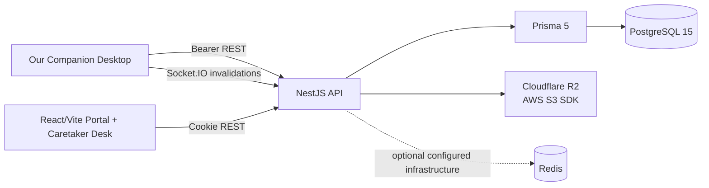
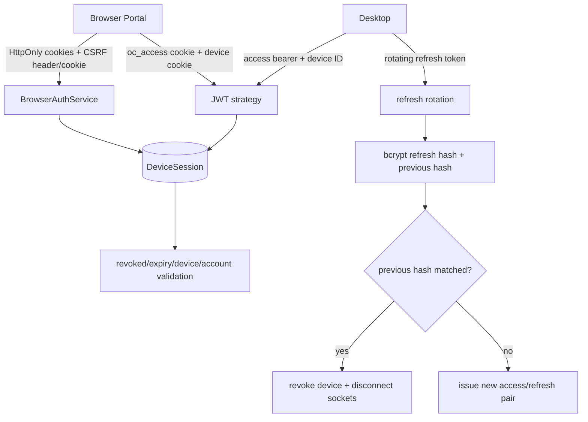
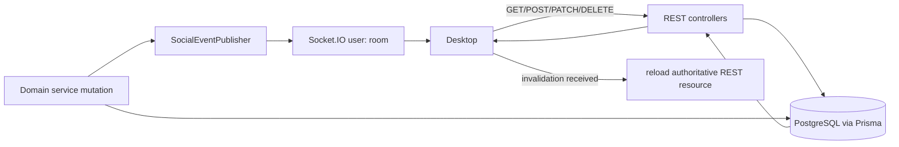
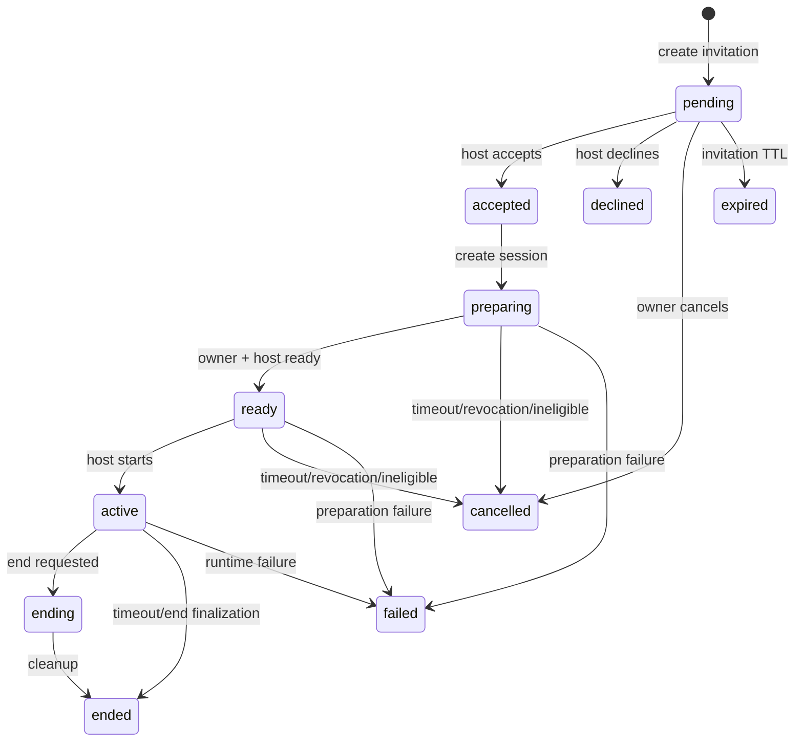

# Our Companion Network architecture overview

This document describes the current `network` repository: one NestJS deployable process, one Prisma/PostgreSQL authority, optional Cloudflare R2 storage, and Socket.IO invalidation/notification delivery.

## 1. System Context



The Network provides identity, device sessions, friends, blocks, presence, public Companion publication, Asset Packs, Visit sessions, Portal operations and Developer Debug observability. REST responses and PostgreSQL state are authoritative. Socket.IO reduces staleness but is not a durable event log.

## 2. Modular Monolith Structure

`AppModule` composes these modules in one application:

- `IdentityModule`: registration, login, JWT validation, refresh rotation and logout.
- `FriendModule`: lookup, requests, friendships and blocks.
- `PresenceModule`: presence REST reads and Socket.IO connection lifecycle.
- `CompanionModule`: Network Companions, publication and Asset Packs.
- `StorageModule`: R2 capability detection, presigned URLs, verification and cleanup primitives.
- `VisitModule`: invitation/session REST state machine and reconciliation.
- `NotificationModule`: notification persistence and Socket.IO delivery.
- `CommunityModule`: public profiles and shared discoveries.
- `PortalModule`: browser authentication and owner-scoped APIs.
- `AdminModule`: SUPERADMIN authorization, Caretaker Desk APIs and audit records.
- `DeveloperDebugModule`: feature-flagged ingestion and Superadmin inspection.
- `MetaModule`, `SmokeModule`, `PrismaModule` and `CommonModule`: compatibility, test support, persistence and shared guards/services.

Services communicate through module interfaces and shared services, not a network of independently deployed microservices.

## 3. Authentication and Device Sessions



Desktop login/register return bearer access and refresh tokens. The refresh token is hashed with bcrypt, and rotation moves the old hash into `previousRefreshTokenHash`. Reuse of that previous token revokes the session and asks the Presence Gateway to disconnect that device. JWT validation checks the matching `DeviceSession`, expiry, revocation and active account status on every authenticated request.

## 4. Browser Portal Security

Portal login creates a device-scoped session and sets Secure, HttpOnly access/refresh cookies plus a device cookie. The `oc_csrf` cookie is deliberately non-HttpOnly so the Portal can copy it to `X-CSRF-Token`.

Mutating browser requests require an allowed exact Origin and a CSRF token whose hash matches both the cookie/header pair and the `DeviceSession`. Comparisons are timing-safe. Portal auth uses cookies because browsers automatically attach credentials and need CSRF/origin defenses; Desktop uses explicit bearer headers and device identifiers.

The current role is loaded from PostgreSQL. Caretaker routes use `SuperadminGuard`, so a role change takes effect without trusting a stale frontend session.

## 5. REST and Socket.IO Coordination



Current event names include `friend.request.created`, `friend.request.updated`, `friendship.created`, `friendship.removed`, `block.created`, `block.removed`, `presence.updated`, `companion.profile.updated`, `companion.profile.unpublished`, `companion.asset_pack.activated`, `visit.invitation.created`, `visit.invitation.updated`, `visit.session.created`, `visit.session.updated`, `visit.session.ended` and `notification:new`.

There are no Visit Socket.IO commands. Visit mutations are REST operations. Presence activity uses `presence.activity` to refresh liveness. Socket connections are placed into per-user rooms and are periodically revalidated against active device sessions.

## 6. Friend and Presence Model

Friend requests transition through the current service rules into friendships or rejected/cancelled states. Blocks are durable, prevent eligible social operations and can end relationships/Visits as required. Friend and block services publish invalidations to affected users.

Presence is persisted in PostgreSQL but the current live connection ownership, activity timers, disconnect grace period and session revalidation are in the Presence Gateway process. A user may have multiple device sockets; aggregate online/idle/offline state is published to eligible friends. Session revocation disconnects matching sockets.

## 7. Companion Publication

An owner creates or updates a `NetworkCompanion`, chooses visibility, stages Asset Packs, activates one pack and publishes the profile. Friends can read a published `friends_only` Companion only when friendship/block rules allow it. Publish/unpublish and active-pack changes notify the owner and eligible friends through invalidation events.

The database keeps the active Asset Pack relationship explicit. A Companion cannot be used for a visual Visit unless its current snapshot satisfies the required manifest contract.

## 8. Asset Pack Integrity Lifecycle

```mermaid
flowchart LR
  Manifest[Validate canonical manifest] --> Records[Create pack/file records]
  Records --> URLs[Presigned staging upload URLs]
  URLs --> Upload[Client uploads to R2 staging]
  Upload --> Inspect[Stream object\nsize + MIME + SHA-256]
  Inspect --> Conditional[ETag-conditional copy]
  Conditional --> Immutable[Immutable final object prefix]
  Immutable --> Verify[Final verification + manifest object]
  Verify --> Activate[Transactional activation]
  Activate --> Supersede[Previous pack superseded]
  Supersede --> Cleanup[Delayed/retryable cleanup]
```



The server validates manifest schema, paths, runtime animation references, per-file hashes, file count and total bytes. R2 staging objects are read through a streaming SHA-256 pass; client metadata is not sufficient. A conditional copy protects against a reused bearer upload URL changing bytes after inspection. Final keys are immutable, the manifest is published only after verified files exist, and activation supersedes the prior pack transactionally.

Storage limits include maximum file bytes, maximum pack bytes, maximum file count, upload-session lifetime, URL expiry, per-user quota and superseded-pack retention. Cleanup claims are durable and retryable; active Visit references are checked before unsafe deletion.

## 9. Visit State Machine



The implementation locks both participants before eligibility checks, locks invitation/session rows during mutations, revalidates friendship and blocks, enforces a maximum of two concurrent host visitors, snapshots the active Companion and Asset Pack references, records participant readiness, uses heartbeat timestamps, enforces preparation and session timeouts, makes allowed repeated operations idempotent and runs periodic cleanup reconciliation. A Visit is a coordinated visual session, not only message delivery.

## 10. Portal and Caretaker Desk

The Portal is a separate React/Vite application under `portal/`. Owner routes cover profile, Companion publication, Asset Pack history, friends, requests, blocks, Visits, devices, password and data/account operations. Caretaker Desk routes are SUPERADMIN-only and provide bounded accounts, Companions, Asset Packs, Visit invitations/sessions, health, audit, storage-cleanup and Developer Debug views.

Portal list endpoints use bounded stable pagination. Mutations requiring administrative authority require a reason and append an audit record. Local CLI commands support initial Superadmin setup and explicit promotion/demotion; production credentials must be explicitly configured and strong.

## 11. Developer Debug Ingestion

```mermaid
flowchart LR
  Local[Desktop local SQLite queue] --> OptIn[Unpackaged + Online + user opt-in]
  OptIn --> Batch[Client redaction + bounded batch]
  Batch --> API[Authenticated POST\n/developer/debug-events/batch]
  API --> Gate[Feature flag + max 50 events + 64 KiB request]
  Gate --> Ownership[User/device ownership from JWT]
  Ownership --> Redact[Server redaction]
  Redact --> Upsert[(userId, clientEventId) idempotent upsert]
  Upsert --> Retention[14-day expiry + bounded pruning]
  Retention --> Inspect[SUPERADMIN list/detail/timeline]
  Inspect --> Audit[admin view audit]
```

The Network accepts debug batches only when `DEVELOPER_DEBUG_INGEST_ENABLED=true`. It enforces a maximum of 50 events and 64 KiB request bytes, redacts sensitive keys and text again, records the authenticated device, deduplicates by `(userId, clientEventId)`, retains events for 14 days and opportunistically prunes at most a bounded batch. Superadmin detail can include a bounded correlation/cycle timeline, and viewing details is audited.

## 12. PostgreSQL Data Model

The Prisma schema groups into:

- `User`, `DeviceSession`, `Profile` and role/account-status fields.
- `FriendRequest`, `Friendship`, `BlockedUser`, `Presence`, `Notification` and legacy/general `Visit` records.
- `NetworkCompanion`, `CompanionAssetPack` and `CompanionAssetFile`.
- `VisitInvitation` and `VisitSession`, including snapshot/reference IDs, readiness, heartbeat, timeout and terminal fields.
- `Discovery` for Community discoveries.
- `AdminAuditLog` for append-only administration history.
- `DeveloperDebugEvent` with user/device ownership, correlation fields, payload, client/receive times and expiry.

Composite uniqueness and indexes support device-scoped sessions, friend request idempotency, one active pack relationships, Visit lookup/cleanup, debug idempotency and bounded administrative queries.

## 13. Storage and Cleanup Workers

Current cleanup is in-process:

- `CompanionCleanupService` reconciles staging and superseded Asset Pack objects.
- `VisitService` expires invitations and times out live sessions on startup and on a periodic timer.
- `AccountDeletionCleanupService` advances account deletion work.
- `StorageService` refreshes R2 capability and verifies object-prefix deletion.
- `DeveloperDebugService` performs bounded opportunistic expiry pruning, with an explicit Superadmin cleanup route.

These timers are safe within one process but are not a distributed job system. Horizontal deployment needs coordinated claims/queues and observability.

## 14. Deployment Assumptions

The current production-shaped topology is one NestJS process, one PostgreSQL database, optional Redis configuration/service, Cloudflare R2 and a Portal static/frontend deployment. Socket.IO connection maps, presence timers, Visit cleanup, storage cleanup and account cleanup are owned in process.

The application can run core identity/social state without R2 when Asset Pack features are unavailable, while publication and visual Visits require configured, healthy storage.

## 15. Horizontal Scaling Requirements

Scaling beyond one application process requires at least:

- Socket.IO Redis adapter or equivalent shared pub/sub/backplane.
- Distributed presence ownership and consistent disconnect/revocation handling.
- Coordinated Visit, Asset Pack, account-deletion and Developer Debug background jobs.
- Centralized metrics, logs and tracing with correlation IDs.
- Production load, concurrency, storage-failure and network-partition testing.

Redis is available in local Compose, but these horizontal-scaling guarantees are not already implemented.

## 16. Testing Strategy

- Jest unit and service tests across identity, friends, presence, Visits, storage, Companion publication, Portal and Developer Debug.
- Backend e2e tests for Visit, Portal security/data and Meta compatibility.
- R2 integration tests for streaming hashes, ETag conditional copy and cleanup verification.
- Prisma migration and concurrency tests for social/Visit invariants.
- Portal TypeScript typecheck, ESLint, Vitest and Playwright.
- `portal:qa` combines Portal typecheck, lint, tests and build; browser e2e remains a separate command.

Environment-dependent tests need PostgreSQL, configured environment variables, R2 and a runnable browser. A documentation update must report those commands as not run unless the prerequisites are present and the command actually passes.
